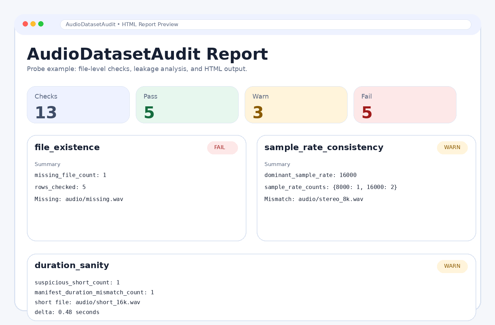

# AudioDatasetAudit

**Find leakage, imbalance, metadata gaps, and file-level audio issues before model training.**

AudioDatasetAudit is an open-source toolkit for auditing speech and audio datasets for leakage, imbalance, metadata gaps, split hygiene, and file-level quality issues before model training or benchmark release.



## Why this exists

Speech and audio results are often weakened by silent dataset issues such as:
- train/test leakage
- same-speaker, same-device, same-date, or same-location overlap across splits
- duplicate recordings
- severe class imbalance
- missing metadata
- inconsistent split definitions
- missing audio files
- corrupted or unreadable files
- inconsistent sample rates or channel counts
- duration metadata that does not match the actual audio on disk

AudioDatasetAudit makes these issues visible through reproducible JSON, Markdown, and HTML reports.

## Current features

- manifest validation
- missing metadata analysis
- class imbalance reports
- duplicate ID and duplicate path detection
- split integrity checks
- speaker leakage detection
- device leakage detection
- date leakage detection
- location leakage detection
- file existence checks
- audio readability checks
- sample-rate consistency checks
- channel consistency checks
- duration sanity checks
- manifest-vs-probed duration mismatch checks
- JSON, Markdown, and HTML reports
- CLI interface

## Installation

```bash
python3 -m venv .venv
source .venv/bin/activate
python3 -m pip install -e '.[dev]'
```

## Quick start

Generate an HTML report from the included probe example:

```bash
python3 -m audiodatasetaudit.cli examples/probe_manifest.csv --format html --output examples/probe_report.html
```

Generate a Markdown report:

```bash
python3 -m audiodatasetaudit.cli examples/probe_manifest.csv --output examples/probe_report.md
```

Generate a JSON report:

```bash
python3 -m audiodatasetaudit.cli examples/probe_manifest.csv --format json --output examples/probe_report.json
```

## Example questions AudioDatasetAudit answers

- Are train, validation, and test splits defined correctly?
- Are some labels dramatically underrepresented?
- Are there duplicate IDs or duplicate file paths?
- Is important metadata missing for many rows?
- Are the same speakers, devices, dates, or locations leaking across splits?
- Are any files missing or unreadable on disk?
- Are sample rates mixed unexpectedly?
- Are some files stereo while others are mono?
- Does the manifest duration disagree with the actual audio?

## Example report assets in this repo

- `examples/leaky_report.md`
- `examples/leaky_report.html`
- `examples/probe_report.md`
- `examples/probe_report.html`

The probe example intentionally includes:
- one missing file reference
- one corrupt audio file
- mixed sample rates
- mixed channel counts
- a very short file
- a manifest duration mismatch

## Manifest schema

### Required columns
- `item_id`
- `path`
- `split`
- `label`

### Optional but recommended columns
- `speaker_id`
- `device_id`
- `collector_id`
- `date`
- `location`
- `language`
- `duration`
- `sample_rate`
- `channels`
- `source_dataset`

### Example manifest

```csv
item_id,path,split,label,speaker_id,device_id,date,location,duration
001,data/audio/001.wav,train,car_horn,spk01,phoneA,2026-01-10,accra,3.2
002,data/audio/002.wav,val,crowd,spk02,phoneB,2026-01-11,accra,2.7
003,data/audio/003.wav,test,market,spk03,phoneC,2026-01-12,kumasi,4.1
```

## Repository layout

```text
audio-dataset-audit/
├── assets/
├── docs/
├── examples/
├── src/audiodatasetaudit/
├── tests/
└── notebooks/
```

## Release and issue drafts included

To make GitHub publishing easier, the repo includes ready-to-paste drafts for releases and issues:

- `docs/releases/v0.2.0.md`
- `docs/releases/v0.3.0-draft.md`
- `docs/github_issues/add-audio-probing.md`
- `docs/github_issues/add-config-support.md`
- `docs/github_issues/add-summary-visualizations.md`

## Roadmap

- **v0.1**: manifest validation, missingness, imbalance, duplicates, split integrity
- **v0.2**: leakage checks and HTML reports
- **v0.3**: file-level audio probing and quality checks
- **v0.4**: config support and summary visualizations
- **v1.0**: stable API, plugins, public dataset examples

## Contributing

Contributions are welcome. Good first areas:
- docs improvements
- new checks
- report templates
- visual summaries for HTML reports
- test cases for edge conditions
- public dataset example manifests

## License

MIT
